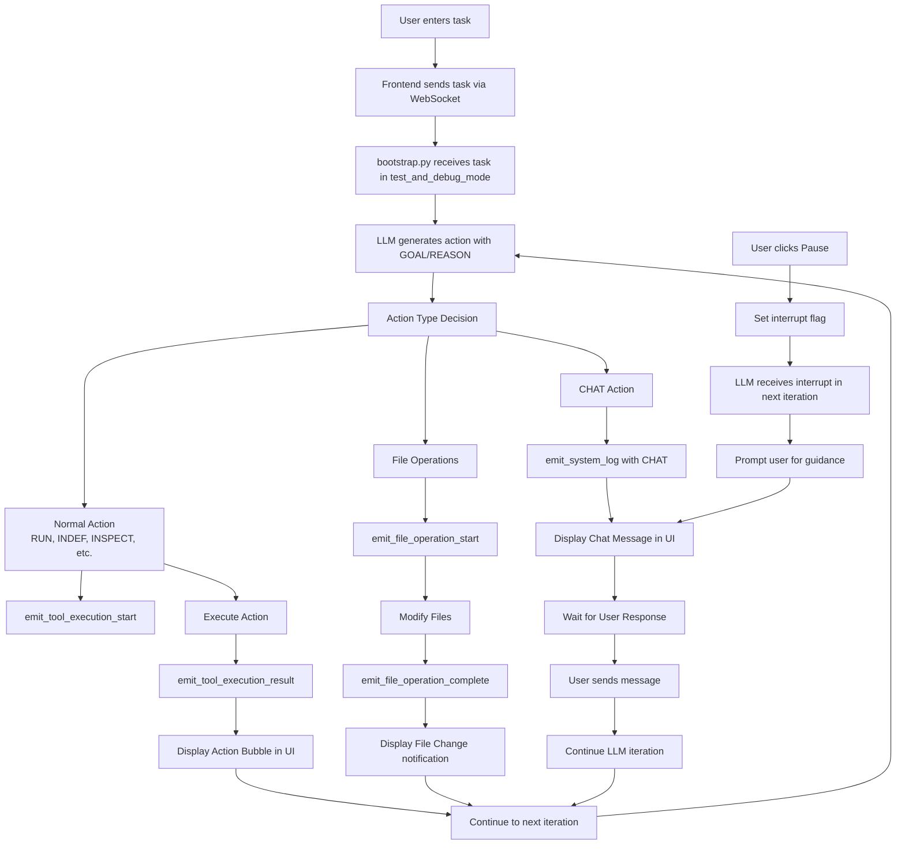

# Agent UI Design Requirements & Architecture

## Overview
The agent UI is a single-chat interface that communicates with `bootstrap.py` via WebSocket events. The agent always operates in "Test and Debug" mode for safe interactive development.

## Current Implementation Check
**🔍 FIRST STEP**: Review the existing WebSocket event system in `bootstrap.py` lines 97-200+ to understand:
- Event emission functions (`emit_*`)
- WebSocket event format (`WEBSOCKET_EVENT:{json}`)
- Existing event types and payloads

## Architecture Flow



## UI Components & Message Types

### 1. Chat Message Types

#### A. Normal Chat Messages (Human ↔ LLM)
- **Trigger**: LLM uses `CHAT:` action or user sends message during pause
- **Events**: `system_log` with level "info" containing chat content
- **UI Display**: Standard chat bubbles (user vs assistant)

#### B. LLM Action Bubbles
- **Trigger**: Any non-CHAT action (RUN, INSPECT, READ, etc.)
- **Events**: `tool_execution_start` → `tool_execution_result`
- **UI Display**: Compact action cards showing:
  ```
  🔧 ACTION: READ: file1.py, file2.py; MODIFY: file1.py
  📋 GOAL: Add error handling to the login function
  💭 REASON: The current code lacks proper exception handling
  ✅ STATUS: Completed / ⚠️ Warning / ❌ Failed
  ```

#### C. System Responses
- **Trigger**: Command outputs, errors, file operations
- **Events**: `system_log`, `file_operation_complete`, process outputs
- **UI Display**: Expandable/collapsible system message cards

### 2. Core UI Elements

#### Main Chat Interface
```
┌─────────────────────────────────────────┐
│ DevLM Agent - Project: [project_name]   │
│ ┌─────────┐ [Pause] [Reset] [Settings] │
│ │  ⏸️     │                            │
│ └─────────┘                            │
├─────────────────────────────────────────┤
│                                         │
│ [User] What's the task for today?       │
│                                         │
│ [Agent] 🔧 INSPECT: src/main.py        │ 
│         📋 GOAL: Check current code     │
│         ✅ Found 3 functions to review  │
│                                         │
│ [System] 📁 File modified: src/main.py  │
│          └─ Added error handling (3 lines) │
│                                         │
│ [Agent] The login function now has      │
│         proper error handling. Ready    │
│         for testing?                    │
│                                         │
├─────────────────────────────────────────┤
│ Type your message... [Send] [📎]       │
└─────────────────────────────────────────┘
```

## WebSocket Event Mapping

### Frontend → Backend Events

```typescript
// Task initiation
{
  type: "user_task",
  payload: {
    taskDescription: string,
    mode: "test" // Always test mode
  }
}

// User interruption (Pause button)
{
  type: "user_interrupt",
  payload: {
    message?: string // Optional guidance message
  }
}

// Chat response during CHAT action
{
  type: "user_chat_response", 
  payload: {
    message: string,
    approvalId?: string // If responding to approval request
  }
}
```

### Backend → Frontend Events (Already Implemented)

```typescript
// Process lifecycle
"process_start" | "process_end" | "phase_change"

// LLM interactions  
"llm_request_start" | "llm_request_success" | "llm_request_error"

// Tool executions (Actions)
"tool_execution_start" | "tool_execution_result" 

// File operations
"file_operation_start" | "file_operation_complete"

// System logs & chat
"system_log" | "waiting_for_approval" | "approval_response_received"
```

## Implementation Requirements

### 1. State Management
```typescript
interface AgentState {
  currentTask: string | null;
  isRunning: boolean;
  isPaused: boolean;
  currentPhase: string;
  runningProcesses: string[];
  chatHistory: ChatMessage[];
  actionHistory: ActionMessage[];
  systemLogs: SystemMessage[];
}
```

### 2. Message Processing Pipeline
1. **Event Listener**: WebSocket message handler
2. **Event Router**: Distribute events to appropriate handlers
3. **State Updater**: Update application state
4. **UI Renderer**: Update chat interface
5. **Notification System**: Show status updates

### 3. Action Bubble Component
```typescript
interface ActionBubble {
  id: string;
  action: string;
  goal: string;
  reason: string;
  status: 'running' | 'success' | 'warning' | 'error';
  startTime: Date;
  endTime?: Date;
  output?: string;
  expandable: boolean;
}
```

### 4. Interruption System
- **Pause Button**: Visible when `isRunning: true`
- **State Change**: `isPaused: true` → show input field for guidance
- **Backend Signal**: Send interrupt event with optional message
- **Resume**: Automatic when user provides guidance or says continue

## Technical Integration Points

### 1. Existing Code Hooks (DO NOT MODIFY)
- `emit_*` functions in bootstrap.py (lines 97-200+)
- `test_and_debug_mode()` main loop (lines 1000+)
- Signal handler for interrupts (lines 1200+)
- WebSocket event format: `WEBSOCKET_EVENT:{json}`

### 2. New Integration Requirements
- WebSocket client in frontend
- Event parsing and routing system
- State synchronization between UI and backend
- Real-time chat message handling

### 3. Error Handling
- Connection loss recovery
- Event parsing failures  
- Backend process crashes
- User interruption edge cases

## User Experience Flow

### Initial Setup
1. User opens agent UI
2. UI prompts for task description
3. User enters task → WebSocket sends to backend
4. Backend starts `test_and_debug_mode()` with task
5. UI shows "Agent is thinking..." state

### During Execution  
1. Backend emits `tool_execution_start` → UI shows action bubble
2. Backend emits `tool_execution_result` → UI updates bubble status
3. File operations → UI shows file change notifications
4. Process outputs → UI shows system messages

### Chat Interactions
1. Backend action: `CHAT: "Need help with X"`
2. UI receives `system_log` → shows as agent message
3. User responds → UI sends `user_chat_response`
4. Backend continues with user input

### Interruption Flow
1. User clicks Pause → UI sends `user_interrupt`
2. Backend sets interrupt flag
3. Next LLM iteration → backend prompts for guidance
4. UI shows chat input for user guidance
5. User provides direction → agent continues

## Next Steps for Implementation

1. **Review Current WebSocket Implementation** in bootstrap.py
2. **Set up WebSocket client** in frontend with event handlers
3. **Create message type components** (action bubbles, system messages)
4. **Implement state management** for chat history and agent status
5. **Add interruption/pause functionality** 
6. **Test with simple task** to verify event flow
7. **Enhance UI polish** and error handling

## Success Metrics

- ✅ All WebSocket events properly displayed in UI
- ✅ User can interrupt and provide guidance seamlessly  
- ✅ File changes and system outputs clearly visible
- ✅ Chat flow feels natural and responsive
- ✅ No modifications needed to bootstrap.py core logic